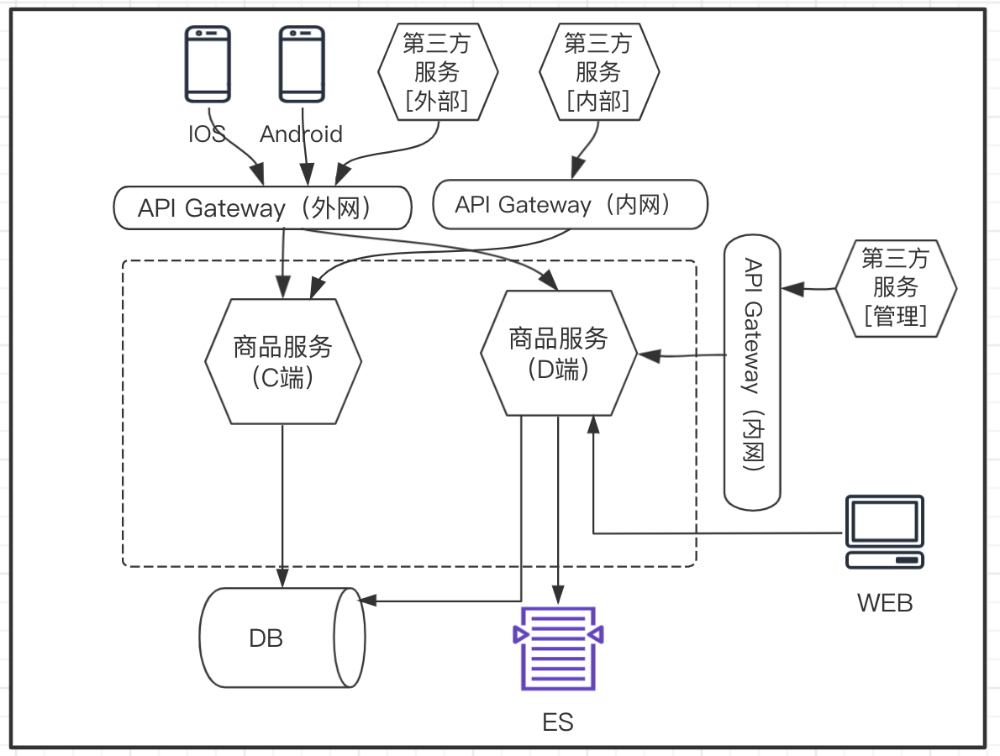

 

  #### 第三方服务

- 核心业务
  - 内部 ：指代关键业务路径上的组织内部服务；例如：订单、售后、会员
  - 外部 ：指代非关键路径上的组织外部服务；例如：智齿客服（第三方客服供应商）
- 管理支撑
  - 指代组织内部其他管理型服务。例如：CRM、卡券后台、活动后台

#### API Gateway

- API网关针对不同的端分为内网、外网两个服务。
  - 外部网关：C端APP及组织外第三方服务通过外网网关访问组织内的微服务。
  - 内部网关：组织内其他业务板块访问本业务板块的服务需通过内部网关访问。
- WEB端本身实现为一个微服务，不需要通过网关访问业务单元内的微服务。

#### 何谓CD端

- 微服务C端：主要为本业务板块APP端API调用及其他业务板块面向C端的关键服务提供支撑。
- 微服务D端：主要为本业务板块的WEB端API调用及其他业务板块的管理后端服务提供支撑。

